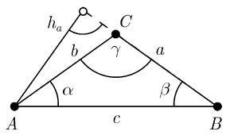
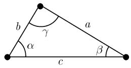
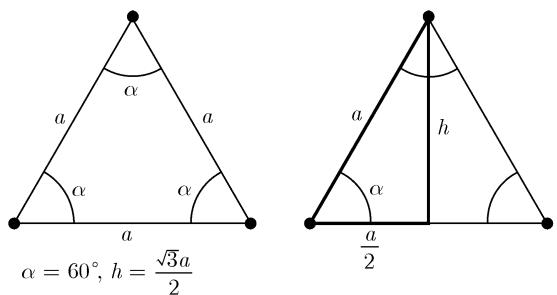
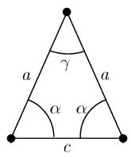
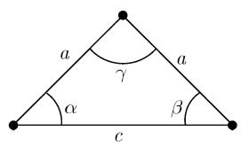
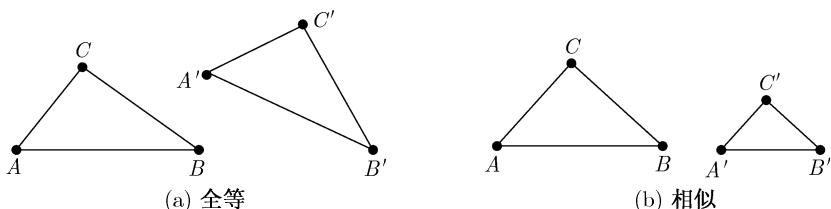

# 《数学指南——实用数学手册》3.2.1 平面三角学

## 概述

本节是《数学指南——实用数学手册》3.2 节「初等几何学」下的子节 3.2.1，性质为**工具性公式汇编**（手册条目）而非论证性论文。它按「记号 → 四个基本定律 → 直角三角形 → 四个基本求解问题 → 特殊直线 → 全等/相似判定」的顺序，集中给出平面三角形的全部常用关系式，并两次回引 3.1 节的变换群框架（[[concepts/全等]]、[[concepts/相似变换]]、[[concepts/埃尔兰根纲领]]），把「全等」「相似」定义为可由 3.1 所述变换相互转化的作图。

全文的记号约定统一为：边 a, b, c 及其对角 α, β, γ；半周长 s = ½(a+b+c)；高 h_a；外接圆半径 R；内切圆半径 r。原文开篇以 **F** 记表面面积，但正文所有公式一律使用 **A**（例如 A = ½ab·sin γ），存在记号不一致（见 [[queries/321节面积记号F与A不一致]]）。

## 记号约定（节首）

- 顶点：三个不共线的点；边：连接每两点的三条线段，记作 a, b, c，其对角记作 α, β, γ（图 3.2(a)）。
- 半周长：$s = \frac{1}{2}(a+b+c)$。
- F 为表面面积，$h_a$ 为三角形在边 a 上的高，R 为外接圆半径，r 为内切圆半径。
- 外接圆是包含整个三角形的最小的圆，它通过所有三个顶点；内切圆是包含在此三角形内最大的圆。

## 3.2.1.1 三角形的四个基本定律

和角定律

$$
\alpha + \beta + \gamma = \pi .\tag{3.1}
$$

余弦定律

$$
c^{2} = a^{2} + b^{2} - 2ab\cos\gamma .\tag{3.2}
$$

正弦定律

$$
\frac{a}{b} = \frac{\sin\alpha}{\sin\beta}.\tag{3.3}
$$

正切定律

$$
\frac{a-b}{a+b} = \frac{\tan\frac{\alpha-\beta}{2}}{\tan\frac{\alpha+\beta}{2}} = \frac{\tan\frac{\alpha-\beta}{2}}{\cot\frac{\gamma}{2}}.\tag{3.4}
$$

其余关系：

- 三角不等式 $c < a+b$。
- 周长 $C = a+b+c = 2s$。
- 高 $h_a = b\sin\gamma = c\sin\beta$。
- 面积 $A = \frac{1}{2}h_a a = \frac{1}{2}ab\cdot\sin\gamma$（原文字面表述：一个三角形的面积等于一条边的长和这条边上的高的乘积的一半）。
- 海伦公式 $A = \sqrt{s(s-a)(s-b)(s-c)} = rs$（原文字面表述：一个三角形的面积等于内切圆半径和三角形周长乘积的一半）。

关于三角形的更多公式：

半角公式

$$
\sin\frac{\gamma}{2} = \sqrt{\frac{(s-a)(s-b)}{ab}},\qquad
\cos\frac{\gamma}{2} = \sqrt{\frac{s(s-c)}{ab}},\qquad
\tan\frac{\gamma}{2} = \frac{\sin\frac{\gamma}{2}}{\cos\frac{\gamma}{2}} .
$$

莫尔韦德公式

$$
\frac{a+b}{c} = \frac{\cos\frac{\alpha-\beta}{2}}{\cos\frac{\alpha+\beta}{2}} = \frac{\cos\frac{\alpha-\beta}{2}}{\sin\frac{\gamma}{2}},
$$

$$
\frac{a-b}{c} = \frac{\sin\frac{\alpha-\beta}{2}}{\sin\frac{\alpha+\beta}{2}} = \frac{\sin\frac{\alpha-\beta}{2}}{\cos\frac{\gamma}{2}} .
$$

正切公式

$$
\tan\gamma = \frac{c\sin\alpha}{b - c\cos\alpha} = \frac{c\sin\beta}{a - c\cos\beta} .
$$

投影定理

$$
c = a\cos\beta + b\cos\alpha .\tag{3.5}
$$

循环置换：更多的公式可由 (3.1) 到 (3.5) 经对边和角的循环置换得到，即 $a \to b \to c \to a$ 与 $\alpha \to \beta \to \gamma \to \alpha$。

特殊三角形与角：一个角为 $\pi/2$（即 $90^{\circ}$）的三角形称为直角三角形（图 3.3）；两条边相等（三条边相等）的三角形称为对称的或等腰的（分别地，等边的）（图 3.5、图 3.4）；角 γ 在 0 与 $90^{\circ}$ 之间（在 $90^{\circ}$ 与 $180^{\circ}$ 之间）时称 γ 为锐角（分别地，钝角）。文中另有一段「在计算器上计算三角形」的提示，说明大部分计算器提供 sin、cos 等三角函数的计算功能。

## 3.2.1.2 直角三角形

在一个直角三角形中，直角所对的边称为斜边，另外两条边称为直角边（中文称勾股）。

面积

$$
A = \frac{1}{2}ab = \frac{a^{2}}{2}\tan\beta = \frac{c^{2}}{4}\sin 2\beta .
$$

毕达哥拉斯定理

$$
c^{2} = a^{2} + b^{2}.\tag{3.6}
$$

原文字面表述：斜边长的平方等于两条直角边长的平方和。并指出因为 $\gamma = \pi/2$ 且 $\cos\gamma = 0$，(3.6) 实际上是余弦定律 (3.2) 的特殊情形。

高的欧几里得定律

$$
h^{2} = pq,
$$

原文字面表述：高的平方等于直角边在斜边上投影线段长度的乘积。

直角边的欧几里得定律

$$
a^{2} = qc,\qquad b^{2} = pc,
$$

原文字面表述：直角边中一条的长的平方等于该边在斜边上的投影长与斜边长的乘积。

角关系

$$
\begin{array}{l}
\sin\alpha = \frac{a}{c},\quad \cos\alpha = \frac{b}{c},\quad \tan\alpha = \frac{a}{b},\quad \cot\alpha = \frac{b}{a},\\
\sin\beta = \cos\alpha,\quad \cos\beta = \sin\alpha,\quad \alpha + \beta = \frac{\pi}{2}.
\end{array}\tag{3.7}
$$

原文指出：由于有关系 $\sin\beta = \cos\alpha$，故正弦定律 (3.3) 变为 $\tan\alpha = \frac{a}{b}$；并约定把 a（分别地，b）作为角 α 相对的（分别地，相邻的）直角边。所有有关直角三角形的问题均可借助 (3.7) 解决，见下表。

表 3.1 直角三角形的公式（原文照录）

| 已知量 | 其他量公式 | | |
|--------|------------|--|--|
| a, b | $\alpha = \arctan\frac{a}{b}$ | $c = \frac{a}{\sin\alpha}$ | $\beta = \frac{\pi}{2} - \alpha$ |
| a, c | $\alpha = \arcsin\frac{a}{c}$ | $b = c\cos\alpha$ | $\beta = \frac{\pi}{2} - \alpha$ |
| b, c | $\alpha = \arccos\frac{b}{c}$ | $a = b\tan\alpha$ | $\beta = \frac{\pi}{2} - \alpha$ |
| a, α | $b = a\cot\alpha$ | $c = \frac{a}{\sin\alpha}$ | $\beta = \frac{\pi}{2} - \alpha$ |
| a, β | $\alpha = \frac{\pi}{2} - \beta$ | $b = a\cot\alpha$ | $c = \frac{a}{\sin\alpha}$ |
| b, α | $a = b\tan\alpha$ | $c = \frac{a}{\sin\alpha}$ | $\beta = \frac{\pi}{2} - \alpha$ |
| b, β | $\alpha = \frac{\pi}{2} - \beta$ | $a = b\tan\alpha$ | $c = \frac{a}{\sin\alpha}$ |

### 例 1（图 3.5(b)）：有相等边的直角三角形

$$
h_c = \frac{a\sqrt{2}}{2}.
$$

原文证明：图 3.5(b) 中的三角形 APC 是直角三角形；由三角形内角和为 $180^{\circ}$ 得 $\alpha = \beta = 45^{\circ}$；因 $\frac{\gamma}{2} = 45^{\circ}$，三角形 APC 有相等边，于是由毕达哥拉斯定理知 $a^{2} = h^{2} + h^{2}$，从而 $h^{2} = a^{2}/2$，$h = a/\sqrt{2} = a\sqrt{2}/2$。又有

$$
\sin 45^{\circ} = \frac{h}{a} = \frac{\sqrt{2}}{2},\qquad \cos 45^{\circ} = \sin 45^{\circ}.
$$

### 例 2（图 3.4(b)）：等边三角形

$$
h_c = \frac{a\sqrt{3}}{2}.
$$

原文证明：毕达哥拉斯定理给出 $a^{2} = h^{2} + \left(\frac{a}{2}\right)^{2}$，由此得到 $4a^{2} = 4h^{2} + a^{2}$，从而 $4h^{2} = 3a^{2}$，即 $2h = \sqrt{3}a$。又有

$$
\sin 60^{\circ} = \frac{h}{a} = \frac{\sqrt{3}}{2},\qquad \cos 30^{\circ} = \sin 60^{\circ}.
$$

## 3.2.1.3 有关三角形的四个基本问题

节首先指出：由方程 $\sin\alpha = d$ 不能唯一确定角 α，因为 α 可以是锐角也可以是钝角，而 $\sin(\pi-\alpha) = \sin\alpha$；下面的方法对第一个和第三个问题给出唯一的角。

第一个问题（已知边 c 及其两个相邻角 α, β）：(i) $\gamma = \pi - \alpha - \beta$；(ii) $a = c\frac{\sin\alpha}{\sin\gamma}$，$b = c\frac{\sin\beta}{\sin\gamma}$；(iii) $A = \frac{1}{2}ab\sin\gamma$。

第二个问题（已知边 a, b 及其夹角 γ）：(i) 由正切定律唯一算出

$$
\tan\frac{\alpha-\beta}{2} = \frac{a-b}{a+b}\cot\frac{\gamma}{2},\qquad -\frac{\pi}{4} < \frac{\alpha-\beta}{2} < \frac{\pi}{4};
$$

(ii) 由和角公式得 $\alpha = \frac{\alpha-\beta}{2} + \frac{\pi-\gamma}{2}$，$\beta = \frac{\pi-\gamma}{2} - \frac{\alpha-\beta}{2}$（原文此处左端印作「a =」，见 [[queries/321节术语与排印疑似讹误]]）；(iii) $c = \frac{\sin\gamma}{\sin\alpha}a$；(iv) $A = \frac{1}{2}ab\sin\gamma$。

第三个问题（已知三条边 a, b, c）：(i) 算出半周长 $s = \frac{1}{2}(a+b+c)$ 与内切圆半径

$$
r = \sqrt{\frac{(s-a)(s-b)(s-c)}{s}};
$$

(ii) 角 α、β 由 $\tan\frac{\alpha}{2} = \frac{r}{s-a}$，$\tan\frac{\beta}{2} = \frac{r}{s-b}$（$0 < \frac{\alpha}{2}, \frac{\beta}{2} < \frac{\pi}{2}$）唯一确定；(iii) $\gamma = \pi - \alpha - \beta$；(iv) 得到面积公式 $A = rs$。

第四个问题（已知两边 a, b 及一个对角 α，即 SSA 情形）：

- 情形 1：$a > b$。于是 $\beta < 90^{\circ}$，β 由正弦定律唯一地由下式决定

$$
\sin\beta = \frac{b}{a}\sin\alpha .\tag{3.8}
$$

- 情形 2：$a = b$。这时正好有 $\alpha = \beta$。
- 情形 3：$a < b$。若 $b\sin\alpha < a$，则方程 (3.8) 给出两个角 β 的解（一锐角一钝角）；**原文写作「当 $b\sin\alpha = b$ 时我们有 $\beta = 90^{\circ}$」**，与通常判别式 $b\sin\alpha = a$ 不符，疑为讹误（见 [[queries/321节第四问题SSA判别条件疑似讹误]]）；当 $b\sin\alpha > a$ 时没有三角形满足此条件。

随后由和角定律定出 $\gamma = \pi - \alpha - \beta$，由正弦定律定出 $c = \frac{\sin\gamma}{\sin\alpha}a$，面积 $A = \frac{1}{2}ab\sin\gamma$。

## 3.2.1.4 三角形中的特殊直线

**中线和中心**：中线定义为通过一边的中点和此边的相对顶点的直线；三条中线交于中心，中心把中线分成从顶点开始度量的 2:1 的两部分（图 3.6(a)）。c 边上中线的长

$$
s_c = \frac{1}{2}\sqrt{a^{2} + b^{2} + 2ab\cos\gamma} = \frac{1}{2}\sqrt{2(a^{2}+b^{2}) - c^{2}} .
$$

**中垂线和外接圆**：一条中垂线是一条垂直于一条边并通过该边中点的线段；三条等距垂线交于外接圆的圆心。外接圆半径

$$
R = \frac{a}{2\sin\alpha}.
$$

**角平分线和内切圆**：一条角平分线通过一个顶点和它的对边，并将此角分成两个相等的角；三条角平分线交于内切圆的中心。内切圆半径

$$
r = (s-a)\tan\frac{\alpha}{2} = \frac{A}{s} = \sqrt{\frac{(s-a)(s-b)(s-c)}{s}},
$$

$$
r = s\tan\frac{\alpha}{2}\tan\frac{\beta}{2}\tan\frac{\gamma}{2} = 4R\sin\frac{\alpha}{2}\sin\frac{\beta}{2}\sin\frac{\gamma}{2}.
$$

角 γ 的平分线的长

$$
w_\gamma = \frac{2ab}{a+b}\cos\frac{\gamma}{2} = \frac{\sqrt{ab\left((a+b)^{2} - c^{2}\right)}}{a+b}.
$$

**泰勒斯定理**（本节第一处，图 3.7）：若三个点位于一个圆周上（其圆心为 M），则圆心角 $2\gamma$ 等于圆周角 γ 的两倍。

## 3.2.1.5 关于全等三角形的定理

两个三角形全等（即它们由 3.1 中所描述的一个变换相关联），当且仅当满足下列四种情形之一（图 3.8(a)）：

1. 两条边和它们的夹角都相等。
2. 一条边和它的两个相邻角都相等。
3. 三条边都相等。
4. 两条边和它们的对角中最大的一个都相等。

## 3.2.1.6 关于相似三角形的定理

两个三角形相似（即它们可由 3.1 的相似变换相互进行变换），当且仅当下面四个情形之一成立（图 3.8(b)）：

1. 两个角相等。
2. 边长的两对比率相等。
3. 边长的一对比率相等并且它们所夹的角也相等。
4. 边长的一对比率相等并且两条边中较长的一条的对角也相等。

**泰勒斯定理（射线定理）**（本节第二处，图 3.9）：设已知两条交于点 C 的直线，如果有两条平行的直线交此两条直线，则对应的三角形 ABC 和三角形 A′B′C 相似，其理由是两个三角形的角和对应边的比率都相等；例如

$$
\frac{CA}{CA'} = \frac{CB}{CB'} .
$$

## 图像

本节随文配图 14 幅（图 3.2—图 3.9），路径前缀为 `media/10-数学指南实用数学手册--9-321-平面三角学--x00nlt/`。其中可辨识内容的有：图 3.2(a) 三角形边角记号、图 3.2(b) 边 a 上的高 $h_a$、图 3.5(b) 等腰直角三角形（$\alpha=\beta=45^{\circ}$、$\gamma=90^{\circ}$、$h=\frac{a\sqrt{2}}{2}$）、图 3.7 圆周角与圆心角、图 3.9 平行截线的相似三角形（α、β 同位角）。其余多幅图像未能加载，具体内容不可核验。

## 与其他页面的关系

- 全等、相似均按 3.1 节的变换群语言定义：见 [[concepts/全等]]、[[concepts/相似性]]、[[concepts/欧氏几何]]、[[concepts/相似几何]]、[[concepts/埃尔兰根纲领]]。
- 角度一律以 $\pi$、$\pi/2$、$30^{\circ}$、$45^{\circ}$、$60^{\circ}$ 混用弧度与度数表示，呼应 [[concepts/弧度制]] 与 [[findings/初等几何学角度弧度约定]]。
- 本节是 3.2 节（[[sources/10-数学指南实用数学手册--8-32-初等几何学--hrjbm1]]）的子节，主题页见 [[concepts/平面三角学]]。

## 疑点与待核

1. 面积记号 F 与 A 混用（[[queries/321节面积记号F与A不一致]]）。
2. 第四个问题中 $b\sin\alpha = b$ 与标准判别式不符（[[queries/321节第四问题SSA判别条件疑似讹误]]）。
3. 第二个问题 (ii) 左端印作「a =」、术语「中心」与「重心/形心」、「中垂线」与「等距垂线」混用等（[[queries/321节术语与排印疑似讹误]]）。

<!-- llm-wiki:embedded-images -->
## Embedded Images

### Document

<!-- llm-wiki:embedded-images -->
