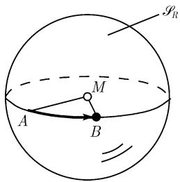
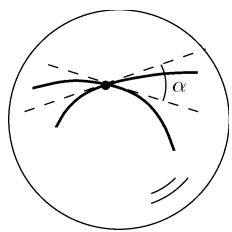

# 《数学指南——实用数学手册》3.2.3 球面几何学

## 概述

本节是《数学指南——实用数学手册》第 3.2 节「初等几何学」下的子节，主题为球面（球的表面）上的几何学，即球面几何学与球面三角学。它在结构上是 3.2.1「平面三角学」的球面类比，并明确服务于 3.2.2 的航海、航空与大地测量应用：当三角形及其距离足够小时，平面三角学公式可作良好近似；当涉及较大距离（例如穿越大西洋的飞行或长途海上旅行）时，地球的弯曲起重要作用，必须改用球面三角学公式。

本节把地球视为正圆球（忽略两极附近的平坦情形）。全节分为四个子小节：

- 3.2.3.1 测量大圆的距离
- 3.2.3.2 测量角
- 3.2.3.3 球面三角形（公式大全）
- 3.2.3.4 球面三角形的计算（四个基本问题）

脚注指出：保留半径 $R$ 是为了能过渡到 $R \to \infty$（欧氏几何），以及作替换 $R \mapsto \mathrm{i}R$（过渡到非欧双曲几何，见 3.2.8）。

## 3.2.3.1 测量大圆的距离

考虑半径为 $R$ 的球，以 $S_R$ 表示其表面（半径为 $R$ 的球面）。约定称圆心为该球中心的 $S_R$ 上的圆为**大圆**：在球面几何中，代替平面几何中直线的是大圆。

**定义**：若 $A$ 和 $B$ 是 $\mathcal{S}_R$ 上的两个点，可以用由 $A$、$B$ 和球的中心 $M$ 构成的平面与 $\mathcal{S}_R$ 的交，得到通过 $A$ 和 $B$ 的大圆。

**例 1**：地球的赤道和经线都是大圆；纬线不是大圆。

**球面上测量距离**：球面上连接两点 $A$ 和 $B$ 的最短线，由考虑 $A$ 与 $B$ 之间的大圆并取两段中较小的一段得到（图 3.15）。按定义，球面上两点 $A$ 和 $B$ 之间的距离是这两点在球面上的最短距离。

**例 2**：若一条船（或一架飞机）想在两点 $A$ 和 $B$ 间采取最短路线，则它必须在连接这两点的大圆上旅行。

- (i) 若 $A$ 和 $B$ 都位于赤道上，则此船只需沿赤道行驶（假定是可能的），见图 3.15(a)；
- (ii) 若 $A$ 和 $B$ 在同一条纬线（不是大圆）上，则最短航线是沿连接这两点的大圆而不是这条纬线，见图 3.15(b)。

**最短路径的唯一性**：若 $A$ 和 $B$ 不是正好为球面的对径点（它们之间的连线通过了球的中心），则有一条唯一确定的最短路径。若 $A$ 和 $B$ 为对径点，则存在无穷多条最短路径，它们的长都相等。

**例 3**：从北极到南极的最短路径由所有径线大圆组成。

**测地线**：大圆的所有线段被称为测地线。

## 3.2.3.2 测量角

**定义**：若两个大圆交于一点 $A$，则它们之间的角定义为在点 $A$ 的两条大圆的切线的夹角（图 3.16）。

**球面对角形**：如果用两个大圆连接球面 $\mathcal{S}_R$ 上两个点 $A$ 和 $B$，便得到了所谓的球面对角形（源文带脚注标记 `*`），其面积为

$$
S = 2 R^{2} \alpha,
$$

其中 $\alpha$ 为两个大圆间的夹角（图 3.17）。

> 注：源文件使用「球面对角形」一词并标注脚注标记，但该脚注在本节文字中未落地；按常见球面几何术语，此图形通常称为球面二角形／月形（lune）。详见 [[323节球面对角形术语与记号疑似讹误]]。

## 3.2.3.3 球面三角形

**定义**：一个球面三角形由球面 $\mathcal{S}_R$ 上三个点 $A, B$ 和 $C$ 和连接这些点的最短路径组成 $^{1)}$。它们的角以 $\alpha, \beta$ 和 $\gamma$ 表示，边长记为 $a, b$ 和 $c$（图 3.18）。

**循环置换**：所有下面的公式在进行循环置换时仍然正确：

$$
a \to b \to c \to a \quad \text{和} \quad \alpha \to \beta \to \gamma \to \alpha .
$$

**球面三角形的面积** $S$：

$$
S = (\alpha + \beta + \gamma - \pi) R^{2}.
$$

因为球面面积本身等于 $4\pi R^2$，由 $0 < S < 4\pi R^2$ 对角的和得到不等式

$$
\pi < \alpha + \beta + \gamma < 3\pi .
$$

若有人不能确认自己生活在球面还是平面上，可通过测量三角形中角的和得到答案：平面三角形总有 $\alpha + \beta + \gamma = \pi$。称差 $\alpha + \beta + \gamma - \pi$ 为**球面角盈**。

**例 1**：图 3.19 中的三角形由北极 $C$ 和赤道上两个点 $A$ 和 $B$ 组成。这里有 $\alpha = \beta = \frac{\pi}{2}$。对于角的和得到 $\alpha + \beta + \gamma = \pi + \gamma$，其面积由 $S = R^{2}\gamma$ 给出。

**三角不等式**：

$$
| a - b | < c < a + b .
$$

**边的比率**：最长的边总对着最大的角，显式地有

$$
\alpha < \beta \Leftrightarrow a < b, \quad \alpha > \beta \Leftrightarrow a > b, \quad \alpha = \beta \Leftrightarrow a = b .
$$

**约定** $^{1)}$：令

$$
a_{*} := \frac{a}{R}, \quad b_{*} := \frac{b}{R}, \quad c_{*} := \frac{c}{R}.
$$

**正弦定律** $^{2)}$

$$
\frac{\sin \alpha}{\sin \beta} = \frac{\sin a_{*}}{\sin b_{*}}. \tag{3.9}
$$

**边和角的余弦定律**

$$
\cos c_{*} = \cos a_{*} \cos b_{*} + \sin a_{*} \sin b_{*} \cos \gamma, \tag{3.10}
$$

$$
\cos \gamma = \sin \alpha \sin \beta \cos c_{*} - \cos \alpha \cos \beta. \tag{3.11}
$$

**半角定律**：令 $S_{*} := \frac{1}{2}(a_{*} + b_{*} + c_{*})$（源文中该记号写作 $S_{*}$，公式中则用 $s_{*}$），则有

$$
\tan \frac{\gamma}{2} = \sqrt{\frac{\sin (s_{*} - a_{*}) \sin (s_{*} - b_{*})}{\sin s_{*} \sin (s_{*} - c_{*})}}, \quad 0 < \gamma < \pi. \tag{3.12}
$$

$$
\sin \frac{\gamma}{2} = \sqrt{\frac{\sin (s_{*} - a_{*}) \sin (s_{*} - b_{*})}{\sin a_{*} \sin b_{*}}}, \quad
\cos \frac{\gamma}{2} = \sqrt{\frac{\sin s_{*} \sin (s_{*} - c_{*})}{\sin a_{*} \sin b_{*}}}.
$$

**球面三角形面积 $A$ 的公式（广义海伦公式）**

$$
\tan \frac{A}{4} = \sqrt{\tan \frac{s_{*}}{2} \tan \frac{s_{*} - a_{*}}{2} \tan \frac{s_{*} - b_{*}}{2} \tan \frac{s_{*} - c_{*}}{2}}.
$$

**半边定律**：设 $\sigma := \frac{1}{2}(\alpha + \beta + \gamma)$，则有

$$
\tan \frac{c_{*}}{2} = \sqrt{\frac{-\cos \sigma \cos (\sigma - \gamma)}{\cos (\sigma - \alpha) \cos (\sigma - \beta)}}, \quad 0 < c_{*} < \pi. \tag{3.13}
$$

$$
\sin \frac{c_{*}}{2} = \sqrt{-\frac{\cos \sigma \cos (\sigma - \gamma)}{\sin \alpha \sin \beta}}, \quad
\cos \frac{c_{*}}{2} = \sqrt{\frac{\cos (\sigma - \alpha) \cos (\sigma - \beta)}{\sin \alpha \sin \beta}}.
$$

**纳皮尔公式**

$$
\tan \frac{c_{*}}{2} \cos \frac{\alpha - \beta}{2} = \tan \frac{a_{*} + b_{*}}{2} \cos \frac{\alpha + \beta}{2},
$$

$$
\tan \frac{c_{*}}{2} \sin \frac{\alpha - \beta}{2} = \tan \frac{a_{*} - b_{*}}{2} \sin \frac{\alpha + \beta}{2},
$$

$$
\cot \frac{\gamma}{2} \cos \frac{a_{*} - b_{*}}{2} = \tan \frac{\alpha + \beta}{2} \cos \frac{a_{*} + b_{*}}{2},
$$

$$
\cot \frac{\gamma}{2} \sin \frac{a_{*} - b_{*}}{2} = \tan \frac{\alpha - \beta}{2} \sin \frac{a_{*} + b_{*}}{2}.
$$

**莫尔韦德公式**

$$
\sin \frac{\gamma}{2} \sin \frac{a_{*} + b_{*}}{2} = \sin \frac{c_{*}}{2} \cos \frac{\alpha - \beta}{2},
$$

$$
\sin \frac{\gamma}{2} \cos \frac{a_{*} + b_{*}}{2} = \cos \frac{c_{*}}{2} \cos \frac{\alpha + \beta}{2},
$$

$$
\cos \frac{\gamma}{2} \sin \frac{a_{*} - b_{*}}{2} = \sin \frac{c_{*}}{2} \sin \frac{\alpha - \beta}{2},
$$

$$
\cos \frac{\gamma}{2} \cos \frac{a_{*} - b_{*}}{2} = \cos \frac{c_{*}}{2} \sin \frac{\alpha + \beta}{2}.
$$

**球面三角形的内切圆和外接圆的半径 $r$ 和 $\rho$**

$$
\tan r = \sqrt{\frac{\sin (s_{*} - a_{*}) \sin (s_{*} - b_{*}) \sin (s_{*} - c_{*})}{\sin s_{*}}} = \tan \frac{\alpha}{2} \sin (s_{*} - a_{*}),
$$

$$
\cot \rho = \sqrt{-\frac{\cos (\sigma - \alpha) \cos (\sigma - \beta) \cos (\sigma - \gamma)}{\cos \sigma}} = \cot \frac{a_{*}}{2} \cos (\sigma - \alpha).
$$

**到平面三角学的极限过程**：若在上述公式中取极限 $R \to \infty$（球面半径无限增大），球面的弯曲变得越来越小，其极限中得到平面三角学的熟悉公式。

**例 2**：应用余弦定律 (3.10)，从 $\cos x = 1 - \frac{x^2}{2} + o(x^2),\ x \to 0$ 和 $\sin x = x + o(x),\ x \to 0$ 推导出

$$
1 - \frac{c^{2}}{2 R^{2}} + \dots = \left(1 - \frac{a^{2}}{2 R^{2}} + \dots\right)\left(1 - \frac{b^{2}}{2 R^{2}} + \dots\right) + \left(\frac{a}{R} + \dots\right)\left(\frac{b}{R} + \dots\right) \cos \gamma .
$$

对其乘以 $R^{2}$ 并对 $R \to \infty$ 便得到平面三角学中的余弦定律

$$
c^{2} = a^{2} + b^{2} - 2 a b \cos \gamma .
$$

**脚注**

1. 常取 $R = 1$，于是 $a_{*} = a$ 等。在公式中保留半径 $R$ 是为了能过渡到 $R \to \infty$（欧氏几何），以及替换 $R \mapsto \mathrm{i}R$（过渡到非欧双曲几何）（见 3.2.8）。
2. 如果 $\alpha$ 是直角，则为 $\sin \alpha = 1$、$\cos \alpha = 0$。

## 3.2.3.4 球面三角形的计算

以下记住 $a_{*} := a / R$ 等，且只考虑所有的角和边介于 $0$ 和 $\pi$ 之间的三角形。

**第一基本问题**：已知两边 $a$ 和 $b$ 连同它们的夹角 $\gamma$。要利用对边的余弦定律计算另一条边 $c$ 和另外的角 $\alpha$ 和 $\beta$：

$$
\cos c_{*} = \cos a_{*} \cos b_{*} + \sin a_{*} \sin b_{*} \cos \gamma,
$$

$$
\cos \alpha = \frac{\cos a_{*} - \cos b_{*} \cos c_{*}}{\sin b_{*} \sin c_{*}},
$$

$$
\cos \beta = \frac{\cos b_{*} - \cos c_{*} \cos a_{*}}{\sin c_{*} \sin a_{*}}.
$$

**第二基本问题**：给出所有三条边 $a, b$ 和 $c$，它们全都在 $0$ 和 $\pi$ 之间。角 $\alpha, \beta$ 和 $\gamma$ 由半边定律计算：

$$
\tan \frac{\alpha}{2} = \sqrt{\frac{\sin (s_{*} - b_{*}) \sin (s_{*} - c_{*})}{\sin s_{*} \sin (s_{*} - a_{*})}} \quad \text{等等}.
$$

对于 $\tan \frac{\beta}{2}$ 和 $\tan \frac{\gamma}{2}$ 的公式可由 $\tan \frac{\alpha}{2}$ 经循环置换得到。

**第三基本问题**：给出三个角 $\alpha, \beta$ 和 $\gamma$。边 $a, b$ 和 $c$ 可由半边定律得到：

$$
\tan \frac{a_{*}}{2} = \sqrt{\frac{-\cos \sigma \cos (\sigma - \alpha)}{\cos (\sigma - \beta) \cos (\sigma - \gamma)}} \quad \text{等等}. \tag{3.14}
$$

对于 $\tan \frac{b_{*}}{2}$ 和 $\tan \frac{c_{*}}{2}$ 可利用循环置换从 $\tan \frac{a_{*}}{2}$ 得到。

**第四基本问题**：已知边 $c$ 和与它相邻的两个角 $\alpha$ 和 $\beta$。未知的角 $\gamma$ 可由余弦定律得到：

$$
\cos \gamma = \sin \alpha \sin \beta \cos c_{*} - \cos \alpha \cos \beta .
$$

其余的边可应用 (3.14) 进行计算。

## 图像

- 图 3.15 球面上的距离（(a) 赤道上的两点；(b) 同纬线上的两点）：`media/10-数学指南实用数学手册--9-323-球面几何学--1e89i27/001-f81b877a7cda3440f8c86e7194a11f20cdcb96ba2bcee6394ffc438145620f60.jpg`、`media/10-数学指南实用数学手册--9-323-球面几何学--1e89i27/002-00499fcbd5b7e4aac7ca3f9f5aea52f703331709cecba672faa081dff43ab9c4.jpg`
- 图 3.16 两个大圆间的角：`media/10-数学指南实用数学手册--9-323-球面几何学--1e89i27/003-f0ff00c53b0da9a797fe06028195d8b2e88d019e001aaf3a5724b64289fd92b1.jpg`
- 图 3.17 球面对角形（弧段 $S$ 与夹角 $\alpha$）：`media/10-数学指南实用数学手册--9-323-球面几何学--1e89i27/004-3aef313b54ec11994e9ce68183803f8bb0061ee335ec2ffdebe2a9b09a54bba7.jpg`
- 图 3.18 球面三角形的角 $\alpha, \beta, \gamma$ 与边 $a, b, c$：`media/10-数学指南实用数学手册--9-323-球面几何学--1e89i27/005-91e63aba2b0d974ed6e63d834b59110b14aecce1b37c9c1d1911ba1b529d7383.jpg`
- 图 3.19 由北极 $C$ 与赤道上两点 $A$、$B$ 构成的球面三角形：`media/10-数学指南实用数学手册--9-323-球面几何学--1e89i27/006-c5dd6ed7cf9ee43f108fb69ff11baf8aecb8d63b72bbd7a3cad166f6fd53ef7f.jpg`

## 关联页面

- 上位与同位内容：[[球面几何学]]、[[球面三角形]]、[[平面三角学]]、[[对大地测量学的应用]]、[[对海上和空中旅行的应用]]
- 核心概念：[[大圆]]、[[测地线]]、[[球面对角形]]、[[球面角盈]]、[[球面正弦定律]]、[[球面余弦定律]]、[[球面半角定律与半边定律]]、[[纳皮尔公式]]、[[球面莫尔韦德公式]]、[[广义海伦公式]]、[[球面三角形的四个基本问题]]、[[球面三角形的内切圆与外接圆]]、[[球面到平面的极限过程]]
- 冠名人物：[[纳皮尔]]、[[莫尔韦德]]、[[海伦]]
- 极限与几何纲领：[[非欧双曲几何学]]、[[欧氏几何]]、[[concepts/三角函数幂乘积的积分]]
- 相关结果页：[[球面大圆距离与最短路径唯一性]]、[[球面三角形面积公式与球面角盈]]、[[球面三角学核心公式组]]、[[球面三角形内切圆与外接圆半径公式]]、[[球面余弦定律的平面极限推导]]、[[球面三角形四个基本问题求解流程]]
- 待澄清问题：[[323节球面对角形术语与记号疑似讹误]]、[[323节R到iR与非欧双曲几何脚注出处]]

<!-- llm-wiki:embedded-images -->
## Embedded Images

### Document

<!-- llm-wiki:embedded-images -->
