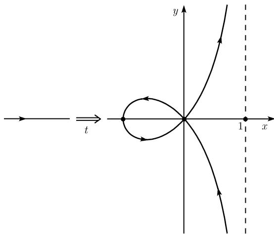
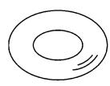
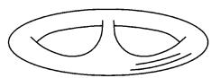

# 《数学指南——实用数学手册》3.8.5 曲线的亏格

## 概述

本节属于 3.8 代数几何学的下级小节，在 [[代数几何学]] 的框架下从 $\mathbb{CP}^2$ 中的不可约代数曲线出发，围绕 [[单值化定理]] 引入曲线的 [[亏格]] 定义，并给出确定亏格的一组公式与若干示例。全节的逻辑链条为：

1. 以**单值化定理**（式 (3.65)）确立曲线存在整体参数化，参数空间 $\mathcal{T}$ 为紧连通一维复流形（即 [[黎曼面]]）；
2. 以参数空间 $\mathcal{T}$ 的拓扑类型**定义亏格**（三种情形 $p=0$、$p=1$、一般 $p$ 个环柄）；
3. 给出亏格的基本不变性（双有理不变）与经验法则（亏格越大结构越复杂）；
4. 列出确定亏格的五条判据/公式与五个编号示例。

节首明确要求过渡到射影坐标：本小节考虑 $\mathbb{CP}^2$ 中的不可约代数曲线，理由是"我们需要了解复曲线上包括无穷远点在内的所有点 $(x,y,u)$"，并且要求参数空间为紧（实轴 $\mathbb{R}$ 不紧，故不满足需要）。

## 单值化定理（式 3.65）

**平面代数曲线的单值化定理**：每条曲线

$$
C: p (x, y, u) = 0
$$

有一个整体的参数化

$$
x = x (t), \quad y = y (t), \quad u = u (t), \quad t \in \mathcal {T},\tag{3.65}
$$

具有下列性质：

(i) 参数空间 $\mathcal{T}$ 是个紧的、连通的一维复的流形，换句话说，是一个黎曼面。

(ii) 由 (3.65) 定义的映射 $\pi: \mathcal{T} \to C$ 是全纯和满的。

(iii) 映射

$$
\pi : \mathcal {T} / \mathcal {S} \to C \setminus S
$$

为双全纯，且参数值的临界集为紧并无内点，即 $\mathcal{S}$ 是个"薄"集。

其中 $S$ 代表曲线 $C$ 的奇点集（必须是有限的），逆象 $\mathcal{S} = \pi^{-1}(s)$ 称为**参数值临界集**。

**注（参数 $t$ 的时间解释与奇点分解）**：将曲线的参数 $t$ 解释为时间，于是 (3.65) 把曲线 $C$ 描述为一个点的（广义）轨线。重要的在于参数空间没有奇点；由于这个原因，也把 (3.65) 称为曲线 $C$ 的一个**奇点分解**。

> 原文中 (iii) 处写为 "$C S$"，据上下文应为 $C \setminus S$（差集）。

## 例 1：环索线（尖点三次线）

首先考虑环索线

$$
(x + u)x^{2} + (x - u)y^{2} = 0
$$

在 $\mathbb{R}^2$ 中的情形。这时有参数化

$$
x = \frac {t ^ {2} - 1}{t ^ {2} + 1}, \quad y = \frac {t (t ^ {2} - 1)}{t ^ {2} + 1}, \quad u = 1, \quad - \infty < t < \infty .\tag{3.66}
$$

在这里的参数空间是实轴 $\mathbb{R}$，没有奇点。如果时间 $t$ 通过所有实数，则图 3.86 中的曲线恰巧被写过一次。但是参数化 (3.66) 并不符合我们的需要，因为需要了解复曲线上包括无穷远点在内的所有点，且要求参数空间为紧，而 $\mathbb{R}$ 不是紧的。

原文随后评论：这个简单例子已经表明了单值化定理远不是平凡的；相反地，它是个极其深刻的数学结果。

图 3.86 的图注为"尖点三次线的单值化"，而正文称该曲线为"环索线"（对应 [[曲线奇点]] 中的相关讨论）。

## 亏格的定义

曲线 $C$ 的亏格是单值化定理的参数空间 $\mathcal{T}$ 的亏格 $p$。按拓扑类型分三种情形：

(i) 如果 $\mathcal{T}$ 同胚于**黎曼球**，则 $p = 0$（图 3.87(a)）。

(ii) 如果 $\mathcal{T}$ 同胚于一个**环面**，则 $p = 1$（图 3.87(b)）。

(iii) 如果以上两种情形都不成立，则 $\mathcal{T}$ 同胚于由黎曼球面安装了 $p$ 个环柄而得到的曲面；称 $p$ 为此曲线的亏格（图 3.87(c)）。

> 原文 (ii) 写为"如果 $\mathcal{T}$ 同胚于一个球面，则 $p=1$"，与 (i) 及上下文（环面、图 3.87(b)）矛盾，疑为"环面"之讹。

**注（亏格有确切定义）**：由于在单值化定理中出现的不同类型的参数化给出了同胚的具同一亏格的参数空间，故亏格是有确切定义的。

**例 2**：在图 3.87(c) 和 (d) 中的两个曲面同胚，即它们可由一个弹性运动变形到另一个，因此它们有同一个亏格（二者图注均为 $p=2$）。

图 3.87 含四张子图：(a) $p=0$、(b) $p=1$、(c) $p=2$、(d) $p=2$。

## 历史注记与基本不变性

黎曼面的亏格是由黎曼在 1857 年当他进行阿贝尔积分的研究时引进的，至少本质上如此。genus（亏格）这个名词则是在 7 年之后由克莱布施（Clebsch）引入的。

**亏格的基本不变性**：曲线的亏格在双有理变换下不变。

这里有一个经验法则：一个曲面的亏格越大，它的结构就越复杂。

## 确定亏格的例子（判据清单）

(i) **庞加莱定理**：一条曲线为有理的，当且仅当其亏格 $p = 0$。这些曲线包括直线、圆锥截线（二次曲线）和有奇点的三次曲线。

(ii) **光滑的三次曲线有亏格 $p = 1$**。按定义，这些是椭圆曲线。

(iii) $n$ 次的**非并曲线**（原文用字，即非奇异/无奇点曲线，non-singular）$C$ 具有亏格

$$
\boxed {p = \frac {(n - 1) (n - 2)}{2}, \quad n = 1, 2, \dots .}
$$

$C$ 的欧拉示性数 $\chi$ 由公式

$$
\boxed {\chi = 2 - 2 p = 2 - (n - 1) (n - 2)}
$$

给出。

(iv) **克莱布施公式**：如果一条不可约的 $n$ 次曲线只有二重点和尖点作为奇点，则对亏格有公式

$$
\boxed {p = \frac {(n - 1) (n - 2)}{2} - c - d,}\tag{3.67}
$$

其中 $d$ 是二重点的个数，$c$ 是尖点的个数。

(v) **哈纳克定理**：一条亏格为 $p$ 的具实系数的（不可约）代数曲线在实区域中最多只有 $p+1$ 个分支。

## 例 3：亏格 1 的三次曲线与实分支

设 $e_{1}, e_{2}$ 和 $e_{3}$ 为满足 $e_{1} < e_{2} < e_{3}$ 的实数，则方程

$$
\boxed {y ^ {2} = (x - e _ {1}) (x - e _ {2}) (x - e _ {3})}
$$

定义了一条亏格 $p = 1$ 的曲线，它由 $p + 1 = 2$ 个分支组成（图 3.88）。该图展示：在 $x$ 轴上标出 $e_1, e_2, e_3$，曲线在 $e_1$ 与 $e_2$ 之间形成一个封闭卵形线，并从 $e_3$ 处向右上下两支无限延伸——这恰是哈纳克定理取等号的实现。

## 例 4：不可约三次曲线的三种情形

若不可约三次曲线 $C$ 有唯一的二重点或尖点，则由 (3.67) 知有不等式

$$
p = 1 - c - d \geqslant 0,
$$

即对于 $C$ 只有下面的三种情形是可能的：

(i) $C$ 正则（即无奇点），见 $p = 1$。

(ii) $C$ 恰好有一个二重点（$d=1$ 且 $c=0$），而此曲线为有理（$p=0$）。

(iii) $C$ 恰好有一个尖点而无二重点（$d=0$ 且 $c=1$），而 $C$ 为有理（$p=0$）。

**注（更一般的公式与假设的自动成立）**：利用奇点重数的概念，可以得到一个比 (3.67) 更一般的公式，由它可推出一条三次曲线除二重点或尖点外没有其他的奇点，就是说，上面关于 $C$ 只有二重点或尖点的假定总是满足的。因此上面所列出的三种情形是三次曲线唯一的可能性。

## 例 5：阿涅西箕舌线

阿涅西箕舌线是有一个二重点的三次曲线，它位于无穷远处，对应于在图 3.79 中画出的那条实渐近线。因此 $d = 1$，$c = 0$ 和 $p = 0$。

## 原文中的公式与结构（逐字保留）

单值化参数化 (3.65)：

```tex
x = x(t),  y = y(t),  u = u(t),  t ∈ T,             (3.65)
```

环索线参数化 (3.66)：

```tex
x = (t^2 - 1)/(t^2 + 1),   y = t(t^2 - 1)/(t^2 + 1),   u = 1,   -∞ < t < ∞   (3.66)
```

非奇异曲线亏格与欧拉示性数：

```tex
p = (n - 1)(n - 2)/2,   n = 1, 2, ...
χ = 2 - 2p = 2 - (n - 1)(n - 2)
```

克莱布施公式 (3.67)：

```tex
p = (n - 1)(n - 2)/2 - c - d,                       (3.67)
```

例 3 的椭圆曲线：

```tex
y^2 = (x - e_1)(x - e_2)(x - e_3),   e_1 < e_2 < e_3
```

例 4 不等式：

```tex
p = 1 - c - d ⩾ 0
```

## 图像

图 3.86 尖点三次线（环索线）的单值化：



图 3.87 各种亏格的曲线（四个子图）：







图 3.88 一条三次曲线的实点：


## 与其他小节的关系

- 本节是 3.8.3 节内部引用所指的"3.8.5"（参见 [[383节内部引用385与114173未落地]]）。
- 本节判据 (i)（庞加莱定理）与既有页面 [[有理参数化]]、[[finding/亏格判据有理表示等价]] 呼应：曲线存在有理表示当且仅当亏格为零。
- 本节判据 (ii) 中"光滑三次曲线 = 椭圆曲线"与 3.8.3 节关于 [[椭圆积分]] 不可有理化、[[椭圆函数]] 的讨论衔接。
- 本节例 1 的环索线与 3.6.1 节关于 [[曲线奇点]] 的判别与分类相关。

<!-- llm-wiki:embedded-images -->
## Embedded Images

### Document


<!-- llm-wiki:embedded-images -->
