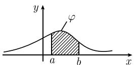
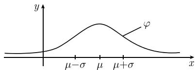

# 《数学指南——实用数学手册》6.1 基本的随机性

## 概述

本节是《数学指南——实用数学手册》第 6 章「概率论与统计学」的开篇，给出概率论的几种基本形式。全节的推进路线是：

1. **6.1.1 古典概型** — 有限等可能样本空间上的概率定义 (6.1)(6.2)，配以掷骰子、抽彩、生日问题三个例子。
2. **6.1.2 伯努利大数定律** — 以抛硬币为模型，说明频率 $H$ 依概率收敛于概率 1/2。
3. **6.1.3 棣莫弗极限定理** — 试验次数 $n \to \infty$ 时二项分布的渐近高斯密度 (6.5)。
4. **6.1.4 高斯正态分布** — 连续型概率密度、分布函数、均值、方差、切比雪夫不等式、置信区间、几种连续型分布。
5. **6.1.5 相关系数** — 二维概率密度、协方差、相关系数 $r$、回归直线与最小二乘法、随机变量独立性。
6. **6.1.6 在经典统计物理学中的应用** — 用 Gibbs 型密度 $\varphi = C\mathrm{e}^{-H/\mathrm{k}T}$ 描述 $N$ 粒子系统，导出麦克斯韦速度分布 (6.8) 与「波动原理」(6.9)。

本节把[[concepts/古典概型]]、[[concepts/伯努利大数定律]]、[[concepts/棣莫弗极限定理]]、[[concepts/高斯正态分布]]、[[concepts/相关系数]]串成一条从离散到连续、从纯概率到物理应用的链条。

## 6.1.1 古典概型

基本模型：随机试验的全部可能结果记为

```
e_1, e_2, …, e_n
```

称 $e_1,\dots,e_n$ 为**基本事件**。(i) **全体事件** $E$ 表示由所有 $e_j$ 组成的集合；(ii) **事件** $A$ 是 $E$ 的一个子集。

概率的定义式 (6.1)：

```
P(A) := A 所包含元素的个数 / n
```

古典文献中的表述 (6.2)：

```
P(A) := 有利结果数 / 可能结果数
```

文中指出：概率概念的这个定义式是雅各布·伯努利在 17 世纪末引入的。

**例：掷一粒骰子** — 基本事件 $e_1,\dots,e_6$。$A := \{e_1\}$ 给出 $P(A) = 1/6$；$B := \{e_2,e_4,e_6\}$ 给出 $P(B) = 3/6 = 1/2$。

**例：掷两粒骰子** — 基本事件 $e_{ij}$（$i,j = 1,\dots,6$），共 36 个。$P(\{e_{ij}\}) = 1/36$；点数相同的概率为 $6/36 = 1/6$。

**例：抽彩问题（「45 取 6」）** — 基本事件形式为

```
e_{i_1 i_2 … i_6},  i_j = 1,…,45,  i_1 < i_2 < … < i_6
```

共 $\binom{45}{6}$ 个。记 $a := 1/\binom{45}{6}$，结果见表 6.1。表中最后一列由参加抽彩游戏的人数乘以各概率得到。

表 6.1 「45 取 6」的抽彩游戏

| 抽得正确数字的个数 | 概率 | 1000万个抽奖者中获胜的人数 |
|---|---|---|
| 6 | $a := \frac{1}{\binom{45}{6}} = 10^{-7}$ | 1 |
| 5 | $\binom{6}{5}\,39\,a = 2\cdot 10^{-5}$ | 200 |
| 4 | $\binom{6}{4}\binom{39}{2}a = 10^{-3}$ | 10 000 |
| 3 | $\binom{6}{3}\binom{39}{3}a = 2\cdot 10^{-2}$ | 200 000 |

**例：生日问题** — 基本事件为

```
e_{i_1 … i_n},  i_j = 1,…,365
```

共 $365^n$ 个。「这 $n$ 个人生日各不相同」包含 $365 \times 364 \times \cdots \times (365 - n + 1)$ 个基本事件，故

```
p = [365^n − 365·364·…·(365 − n + 1)] / 365^n        (6.3)
```

表 6.2 生日问题

| 客人数 | 20 | 23 | 30 | 40 |
|---|---|---|---|---|
| 至少有两位客人生日相同的概率 | 0.4 | 0.5 | 0.7 | 0.9 |

## 6.1.2 伯努利大数定律

**抛一枚硬币** — 基本事件为

```
e_1, e_2        (6.4)
```

其中 $e_1$ 表示「正面向上」，$e_2$ 表示「反面向上」。事件 $A = \{e_1\}$ 的概率为

```
P(A) = 1/2
```

**频率** — 将硬币抛 $n$ 次，基本事件为

```
e_{i_1 i_2 … i_n},  i_1,…,i_n = 1,2
```

频率定义为

```
H(e_{i_1 i_2 … i_n}) := (正面向上发生的次数) / (试验次数 n)
```

**伯努利大数定律** — 设 $\varepsilon > 0$ 任意给定，记 $A_n$ 为满足

```
| H(e…) − 1/2 | < ε
```

的所有基本事件组成的集合，则

```
lim_{n→∞} P(A_n) = 1
```

亦可写成

```
lim_{n→∞} P( | H_n − 1/2 | < ε ) = 1
```

文中说明，伯努利利用公式 (6.1) 计算了概率 $P(A_n)$ 并证明此定理。

## 6.1.3 棣莫弗极限定理

设 $A_{n,k}$ 表示恰好有 $k$ 个下标为「1」的所有基本事件 $e_{i_1 i_2 \cdots i_n}$ 组成的集合，则

```
P( H_n = k/n ) = C(n,k) · 1/2^n
```

**棣莫弗定理（1730）** — 当试验次数 $n$ 很大时，有渐近等式

```
P(H_n = k/n) ~ (1/(σ√(2π))) e^{−(k−μ)²/(2σ²)},  k = 1,2,…,n     (6.5)
```

其中参数 $\mu = n/2$，$\sigma = \sqrt{n/4}$。(6.5) 右边的函数即高斯正态分布的概率密度（图 6.2）。当 $k = n/2$ 时，(6.5) 中的概率 $P$ 取最大值。

## 6.1.4 高斯正态分布

**测量过程的基本模型** — 给定连续（或几乎处处连续）函数 $\varphi : \mathbb{R} \to \mathbb{R}$，满足

```
∫_{−∞}^{∞} φ dx = 1
```

设随机测量变量 $X$：

```
P(a ≤ X ≤ b) := ∫_a^b φ(x) dx
```

称 $\varphi$ 为 $X$ 的**概率密度**，称

```
Φ(x) := ∫_{−∞}^{x} φ(ξ) dξ,  x ∈ ℝ
```

为由 $\varphi$ 确定的**分布函数**（图 6.1(a)(b)）。均值与方差定义为

```
X̄ := ∫_{−∞}^{∞} x φ(x) dx
(ΔX)² := ∫_{−∞}^{∞} (x − X̄)² φ(x) dx
```

并称非负量 $\Delta X$ 为 $X$ 的标准差。若把 $\varphi$ 理解为质量密度，则 $\overline{X}$ 就是质量中心。

**切比雪夫不等式** — 对任意 $\beta > 0$，

```
P( |X − X̄| > β ΔX ) ≤ 1/β²
```

特别地当 $\Delta X = 0$ 时有 $P(X = \overline{X}) = 1$。

**置信区间** — 设 $0 < \alpha < 1$，随机变量 $X$ 的测量值落入区间

```
[ X̄ − ΔX/√α ,  X̄ + ΔX/√α ]
```

的概率大于 $1 - \alpha$。例 1：取 $\alpha = 1/16$，则落入 $[\overline{X} - 4\Delta X, \overline{X} + 4\Delta X]$ 的概率大于 $15/16$。这一结果说明标准差 $\Delta X$ 越小，测量值越密集在均值附近。

**高斯正态分布 $N(\mu,\sigma)$** — 概率密度为

```
φ(x) := (1/(σ√(2π))) e^{−(x−μ)²/(2σ²)},  x ∈ ℝ
```

参数 $\mu, \sigma$ 为实数且 $\sigma > 0$，并且

```
X̄ = μ,  ΔX = σ
```

文中强调正态分布是概率论中最重要的分布，理由是中心极限定理：任何由大量相互独立的随机变量叠加而成的随机变量都近似服从正态分布（见 6.2.4）。

**指数分布** — 概率密度见表 6.3，用于描述产品（如灯泡）的使用寿命等，此时

```
∫_a^b (1/μ) e^{−x/μ} dx
```

是使用寿命落入 $[a,b]$ 的概率，产品的平均使用寿命为 $\mu$。

表 6.3 几种连续型分布

| 分布名称 | 概率密度 $\varphi$ | 均值 $\overline{X}$ | 标准差 $\Delta X$ |
|---|---|---|---|
| 正态分布 $N(\mu,\sigma)$ | $\frac{1}{\sigma\sqrt{2\pi}}\mathrm{e}^{-(x-\mu)^{2}/2\sigma^{2}}$ | $\mu$ | $\sigma$ |
| 指数分布（图 6.3） | $\frac{1}{\mu}\mathrm{e}^{-x/\mu}$（$x \geqslant 0$，$\mu>0$）；$0$（$x<0$） | $\mu$ | $\mu$ |
| 均匀分布（图 6.4） | $\frac{1}{b-a}$（$a \leqslant x \leqslant b$）；$0$（其他） | $\frac{b+a}{2}$ | $\frac{b-a}{\sqrt{12}}$ |

**随机变量的函数的均值** — 设 $Z = F(X)$，则

```
Z̄ = ∫_{−∞}^{∞} F(x) φ(x) dx
(ΔZ)² = ∫_{−∞}^{∞} (F(x) − Z̄)² φ(x) dx
```

例 2：$(\Delta X)^2 = \overline{(X-\overline{X})^2} = \int_{-\infty}^{\infty}(x - \overline{X})^2 \varphi(x)\,\mathrm{d}x$。

**均值加法公式**

```
F(X) + G(X) 的均值 = F(X) 的均值 + G(X) 的均值
```

## 6.1.5 相关系数

文中指出，对于任意的测量来说，最重要的量是均值、标准差和满足 $-1 \leqslant r \leqslant 1$ 的相关系数 $r$；且 $|r|$ 越大，两个测量量的相关性（相互依赖性）越强。

**测量两个随机变量的基本模型** — 给定几乎处处连续的非负函数 $\varphi : \mathbb{R}^2 \to \mathbb{R}$，满足

```
∫∫_{ℝ²} φ(x,y) dx dy = 1
```

(i) 随机向量 $(X,Y)$；(ii) 概率

```
P((X,Y) ∈ G) := ∫∫_G φ(x,y) dx dy
```

(iii) 边缘概率密度

```
φ_X(x) := ∫_{−∞}^{∞} φ(x,y) dy,   φ_Y(y) := ∫_{−∞}^{∞} φ(x,y) dx
```

(iv) 均值与方差由各自的边缘密度计算；(v) 函数 $Z = F(X,Y)$ 的均值

```
Z̄ := ∫∫_{ℝ²} F(x,y) φ(x,y) dx dy
```

(vi) 方差

```
(ΔZ)² := (Z − Z̄)² 的均值 = ∫∫_{ℝ²} (F(x,y) − Z̄)² φ(x,y) dx dy
```

(vii) 均值加法公式。

**协方差**

```
Cov(X,Y) := (X − X̄)(Y − Ȳ) 的均值 = ∫∫_{ℝ²} (x − X̄)(y − Ȳ) φ(x,y) dx dy
```

**相关系数**

```
r = Cov(X,Y) / (ΔX ΔY)
```

恒满足 $-1 \leqslant r \leqslant 1$，即 $r^2 \leqslant 1$。

**解决方案（回归直线）** — 考虑最小化问题

```
(Y − a − bX²) 的均值 = min,  a,b ∈ ℝ        (6.6)
```

即寻找最密切逼近 $Y$ 的线性函数 $a + bX$；该最小化问题相应于高斯的**最小二乘法**。(a) (6.6) 的解是回归直线

```
Ȳ + r (ΔY/ΔX) (X − X̄)
```

(b) 对应该解有

```
(Y − a − bX)² 的均值 = (ΔY)² (1 − r²)
```

当 $r^2 = 1$（或 $r = 0$）时得到最好（或最差）的逼近。

**例（用测量值估计）** — 给定测量值 $x_1,\dots,x_n$ 与 $y_1,\dots,y_n$，回归直线 $y = \overline{Y} + r\frac{\Delta Y}{\Delta X}(x - \overline{X})$ 是最好地拟合这些点的直线（图 6.5）。真值未知时可用下式估计：

```
X̄ = (1/n) Σ_{j=1}^n x_j
(ΔX)² = (1/(n−1)) Σ_{j=1}^n (x_j − X̄)²
r = (1/((n−1) ΔX ΔY)) Σ_{j=1}^n (x_j − X̄)(y_j − Ȳ)
```

**随机变量的独立性** — 若联合概率密度可因式分解

```
φ(x,y) = a(x) b(y),  (x,y) ∈ ℝ²
```

则称 $X$ 与 $Y$ 相互独立。此时有：(i) $\varphi_X = a$，$\varphi_Y = b$；(ii) 概率乘法公式 $P(a \leqslant X \leqslant b,\ c \leqslant Y \leqslant d) = P(a \leqslant X \leqslant b)\,P(c \leqslant Y \leqslant d)$；(iii) 均值乘法公式 $\overline{F(X)G(Y)} = \overline{F(X)}\cdot\overline{G(Y)}$；(iv) 相关系数 $r$ 为 0（脚注：由 $\overline{X - \overline{X}} = 0$ 与 $\overline{(X-\overline{X})(Y-\overline{Y})} = \overline{(X-\overline{X})}\cdot\overline{(Y-\overline{Y})} = 0$ 得到）；(v) 方差加法公式

```
(Δ(X+Y))² := (ΔX)² + (ΔY)²
```

**二维高斯正态分布**

```
φ(x,y) := (1/(σ_x√(2π))) e^{−(x−μ_x)²/(2σ_x²)} · (1/(σ_y√(2π))) e^{−(y−μ_y)²/(2σ_y²)}
```

它是两个一维正态分布密度的乘积，相应于两个相互独立随机变量 $X$ 和 $Y$ 的联合分布，且 $\overline{X} = \mu_x$，$\Delta X = \sigma_x$，$\overline{Y} = \mu_y$，$\Delta Y = \sigma_y$，$(\Delta(X+Y))^2 = \sigma_x^2 + \sigma_y^2$。

## 6.1.6 在经典统计物理学中的应用

考虑由 $N$ 个质量为 $m$ 的粒子组成的系统，系统能量

```
E = H(q, p)
```

其中 $H$ 是系统的哈密顿函数。设每个粒子有 $f$ 个自由度，$q = (q_1,\dots,q_{fN})$ 为坐标，$p = (p_1,\dots,p_{fN})$ 为广义动量变量。

**经典力学** — 运动方程由典范方程组给出：

```
q_j′(t) = H_{p_j}(q(t), p(t)),  p_j′(t) = −H_{q_j}(q(t), p(t)),  j = 1,…,fN
```

变量 $(q,p)$ 在 $\mathbb{R}^{fN}$ 的区域 $\Pi$ 中运动，称 $\Pi$ 为系统的**相空间**（有关哈密顿力学的基本概念见 5.1.3）。

**经典统计力学** — 从概率密度出发

```
φ(q,p) := C e^{−H(q,p)/(kT)}
```

常数 $C$ 由 $\int_\Pi \varphi\,\mathrm{d}q\,\mathrm{d}p = 1$ 确定；$T$ 为绝对温度，$k$ 为玻尔兹曼常量。由 $\varphi$ 引入的量：

(i) 系统落入相空间子区域 $G$ 的概率

```
P(G) = ∫_G φ(q,p) dq dp        (6.7)
```

(ii) 函数 $F = F(q,p)$ 的均值与方差

```
F̄ = ∫_Π F(q,p) φ(q,p) dq dp
(ΔF)² = ∫_Π (F(q,p) − F̄)² φ(q,p) dq dp
```

(iii) 两个函数 $A, B$ 的相关系数

```
r = (1/(ΔA ΔB)) · (A − Ā)(B − B̄) 的均值
```

(iv) 系统在绝对温度 $T$ 时的熵

```
S = −k · (ln φ) 的均值
```

**对麦克斯韦速度分布的应用** — 考虑由 $N$ 个质量为 $m$ 的粒子组成的、在 $\mathbb{R}^3$ 有界区域 $\Omega$ 中运动的理想气体，$V$ 为 $\Omega$ 的体积。第 $j$ 个粒子由坐标向量 $x_j = x_j(t)$ 与动量向量 $p_j(t) = m x_j'(t)$ 描述。若 $v$ 表示粒子速度向量的任意一个笛卡儿分量，则

```
P(a ≤ mv ≤ b) = ∫_a^b (1/(σ√(2π))) e^{−x²/(2σ²)} dx        (6.8)
```

这是 $mv$ 落入 $[a,b]$ 的概率，相应分布为均值 $\overline{mv} = 0$、标准差 $\Delta(mv) = \sigma = \sqrt{mkT}$ 的高斯正态分布。该定律由麦克斯韦于 1860 年确立，为玻尔兹曼建立统计力学奠定了基础。

推理：取 $p_1 = p_1 i + p_2 j + p_3 k$，$p_2 = p_4 i + p_5 j + p_6 k$，$\dots$ 以及 $x_1 = q_1 i + q_2 j + q_3 k$，$\dots$。理想气体粒子之间无相互作用，总能量为各粒子动能之和

```
E = p_1²/(2m) + … + p_N²/(2m) = Σ_{j=1}^{3N} p_j²/(2m)
```

考虑 $p_1 = mv$，由 (6.7) 有

```
P(a ≤ p_1 ≤ b) = C ∫_a^b exp(−p_1²/(2mkT)) dp_1 · J
```

其中 $J$ 由对 $p_2 \cdots p_{3N}$ 从 $-\infty$ 到 $\infty$ 的积分以及关于坐标 $q_j$ 的积分得到，$CJ$ 的值由规范化条件 $P(-\infty < p < \infty) = 1$ 求出，从而得到 (6.8)。

**波动原理** — 经典统计力学中的关键问题是：为什么了解气体的统计性质必须具备非常灵敏的测量能力？答案在对理想气体成立的基本公式中：

```
ΔE / Ē = (1/√N) · (Δε / ε̄)        (6.9)
```

其中 $N$ 为粒子数，$E$ 为总能量，$\varepsilon$ 为单个粒子的能量。由于 $\Delta\varepsilon/\overline{\varepsilon}$ 近似等于 1，而 $N$ 的量级为 $10^{23}$，因此气体能量的相对方差 $\Delta E/\overline{E}$ 相当小，在日常生活中没有任何明显作用。推理：理想气体粒子间无相互作用，每个粒子的能量是相互独立的随机变量，故可应用均值与方差的加法公式，得到 $\overline{E} = N\overline{\varepsilon}$，$(\Delta E)^2 = N(\Delta\varepsilon)^2$，由此得 (6.9)。

**具有可变粒子数和化学势的系统** — 化学反应期间粒子数可以变化，相应的统计物理学需要考虑参数 $T$（绝对温度）与参数 $\mu$（化学势），有关讨论见 [212]，那里考虑了一个也可应用于现代量子统计（原子、分子、光子和基本粒子的统计）的一般方案。

## 引用的本地图像

- 图 6.1(a) 概率密度：`media/10-数学指南实用数学手册--9-61-基本的随机性--1r43h9a/001-193fb9100d4c0b86a6bcbb139202b478d83dc3d64c9017a24695f76810c44588.jpg`
- 图 6.1(b) 分布函数：`media/10-数学指南实用数学手册--9-61-基本的随机性--1r43h9a/002-f24cc9bc8879e10632cd68da6043e7e485d1bcb21bcc04a897a43f04bfff53f3.jpg`（图像数据未成功加载）
- 图 6.2 高斯正态分布：`media/10-数学指南实用数学手册--9-61-基本的随机性--1r43h9a/003-4a2470ea3ddcbdd9670fca91ca04daaec712e046b8e4370d77ad9677d7bb7e17.jpg`（图像数据未成功加载）
- 图 6.3 指数分布：`media/10-数学指南实用数学手册--9-61-基本的随机性--1r43h9a/004-cf9c40c090d9518445064965f07b09c041666749aee28178b1384c5b6f9a7881.jpg`
- 图 6.4 均匀分布：`media/10-数学指南实用数学手册--9-61-基本的随机性--1r43h9a/005-53d5336770b87fca1b2ab4c337d35b6f477f978075deba67c969010a8a0f6d20.jpg`
- 图 6.5 回归直线：`media/10-数学指南实用数学手册--9-61-基本的随机性--1r43h9a/006-2f5ecc291161e86e2526d1ba8284a4d088944755fdcce6c95a28e9a3a0771482.jpg`

## 关键实体与概念

- 人物：[[entities/雅各布-伯努利]]、[[entities/棣莫弗]]、[[entities/麦克斯韦]]、[[entities/玻尔兹曼]]、[[entities/切比雪夫]]、[[entities/高斯]]
- 概念：[[concepts/古典概型]]、[[concepts/伯努利大数定律]]、[[concepts/棣莫弗极限定理]]、[[concepts/高斯正态分布]]、[[concepts/相关系数]]、[[concepts/经典统计物理学]]、[[concepts/麦克斯韦速度分布]]、[[concepts/玻尔兹曼常量]]
- 与既有页面衔接：[[concepts/哈密顿方程]]、[[concepts/相空间哈密顿流]]、[[concepts/勒让德变换]]、[[entities/哈密顿]]

## 节内疑点

- [[queries/615节方程66中bX平方疑点]]
- [[queries/615节均值加法公式Fxy与FXY记号不一致]]
- [[queries/616节玻尔兹曼常量取自然数值表述疑点]]
- [[queries/61节多处脚注标记缺脚注正文]]
- [[queries/61节图61b与图62未能加载]]
- [[queries/616节参考文献212与62节中心极限定理前向引用未落地]]

<!-- llm-wiki:embedded-images -->
## Embedded Images

### Document






<!-- llm-wiki:embedded-images -->
